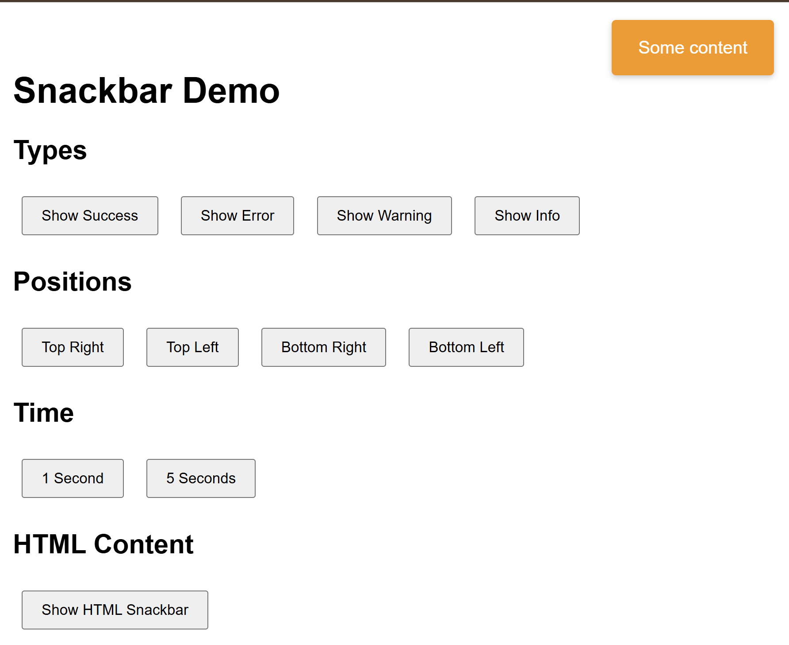

# Snackbar

Lightweight snackbar made with AI in less than 5 minutes.

- 🎨 Multiple pre-defined styles (success, error, warning, info)
- 📍 Flexible positioning (top-right, top-left, bottom-right, bottom-left)
- ⏱️ Customizable timespan
- 📚 Support for stackng
- 🎯 BS-compatible styling
- 💫 Animations
- 📱 Responsive design
- 🔧 Support for text and HTML content

## Usage

```html
<link rel="stylesheet" href="snackbar.css">
<script src="snackbar.js"></script>
```

```javascript
Snackbar.show('Your message')

Snackbar.show('Some message', {
  type: Snackbar.types.SUCCESS,
  position: Snackbar.positions.TOP_RIGHT,
  timespan: 3000
})

Snackbar.show('<strong>Bold</strong> and <em>emphasized</em> text')
```

- types: SUCCESS, ERROR, WARNING, INFO
- position: TOP_RIGHT, TOP_LEFT, BOTTOM_RIGHT, BOTTOM_LEFT

## Demo

Check out `demo.html` for a live demonstration of all features.




## License

Copyright (C) Walter A. Jablonowski 2025, free under [MIT license](LICENSE)

This app is build upon javascript and free software

[Privacy](https://walter-a-jablonowski.github.io/privacy.html) | [Legal](https://walter-a-jablonowski.github.io/imprint.html)
